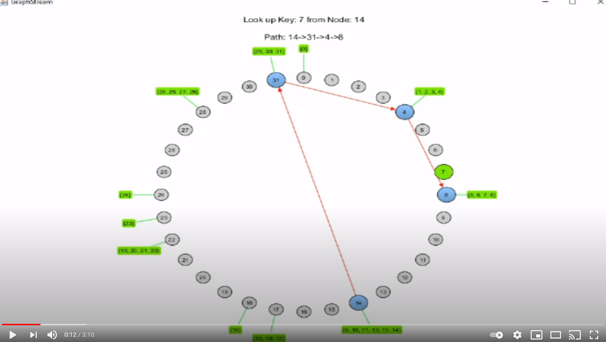

# Distributed Hash Table Lookup System
## Introduction
Hello! Wow that title is a mouthful! This was a project that I worked on in my Distributed Systems class. The purpose
is to show how popular peer-to-peer file systems like <TODO> send files to each other.
## To Run
*dht.exe* produces output that the *dht.class* uses in order to work. Redirect this output into a file *dht.dgs* and
run *dht.class*.

    ./dht > dht.dgs
    java -cp "jars/gs-algo-1.3/gs-algo-1.3.jar;jars/gs-core-1.3/gs-core-1.3.jar;jars/gs-ui-1.3/gs-ui-1.3.jar;" dht
## To Compile and Run
If you wanted to compile and run the program, here are the commands that you should run.

    gcc -Wall dht.c -o dht -lm
    ./dht > dht.dgs
    javac -cp "jars/gs-algo-1.3/gs-algo-1.3.jar;jars/gs-core-1.3/gs-core-1.3.jar;jars/gs-ui-1.3/gs-ui-1.3.jar;" dht.java
    java -cp "jars/gs-algo-1.3/gs-algo-1.3.jar;jars/gs-core-1.3/gs-core-1.3.jar;jars/gs-ui-1.3/gs-ui-1.3.jar;" dht
## Video Demonstration
The following video shows a couple lookups with 32, 64, and 128 nodes.

